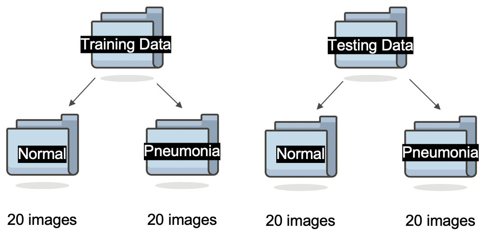

# Diagnosing Pneumonia from X-ray Images
## Team Information
* Team Name: CONP Apps
* Team Members: Chelsea Rosen, Omar Zermeno, Nico de Jong, and Peyton Warp
* Course: BME 3053C Computer Applications for BME, Fall 2020
* J. Crayton Pruitt Family Department of Biomedical Engineering, University of Florida
## Project Description
The aim of this project is to create a machine learning model that can predict whether an x-ray image shows signs of pneumonia. 
With the COVID-19 pandemic, there has been a large uptake of patients in hospitals that have signs of pneumonia. This program could 
quickly make a prediction of a diagnosis for hundreds, if not thousands, of x-ray images, quicker than a doctor could. 
#### Data Source
Chest x-ray images were pulled from the ["Chest X-Ray Images (Pneumonia)"][1] dataset from Kaggle. We pulled 80 .jpeg images total from this dataset 
for our project. We used 40 images to train the models and 40 images to test the models. In each set of data, we had 20 x-ray images of normal lungs and 20 x-ray images of lungs with pneumonia. The exact images used can be found in the 'Training Data' and 'Testing Data' folders uploaded. 

## Functions
The team created three different functions to pull features from the x-ray images to create the machine learning models. A description of each function follows.

### LungScan
LungScan processes the raw chest x-ray and removes the border of the image, it then binarizes the lung region and identifies darker healthy looking portions of the lung and creates a binary mask of these areas by closing the isolated area. Then, the binary image is analyzed using regionprops and all smaller white specks not within the lungs like darker regions of the spine and outside potions that could be clouding the data are removed, resulting in the output: a binary mask over the healthy looking portions of the lungs. 

### Sml2Lrg
Sml2Lrg splits the binary LungScan image into two images, one containing the enclosed left lung and the other the right lung. The function then finds the number of non-zero elements in each image, and divides the smaller number by the larger. Essentially this function establishes a ratio between the area of the smaller to the area of the larger lung.

### ChestInt
ChestInt used edge detection and image closing on the raw x-ray in order to create a binary mask covering the entire torso region of the image. The regionprops function is then used here to find the centroid of this mask and the image is cropped to be from 1/3 of the centroid value to 2/3 of the centroid value in both height and width. The average intensity of this cropped image is then taken for the final output of this function. Because pneumonia lungs are more cloudy than regular lungs, pneumonia images will result in typically higher average intensities.

## Pulling Features from X-ray Images
The uploaded script, PropertiesLung.m, is used to pull appropriate features from the x-ray images in order to create the machine learning model. To use this script,
load the Training Data and Testing Data folders into MATLAB and then run the script accordingly. The output will be two .mat files, TrainData.mat and TestData.mat. 

## Machine Learning Models
We created three different models in order to see which would be the most accurate. A description of the decision tree, k-nearest neighbors, and linear discriminant analysis models created follows. 

### Decision Tree (DT) Model
The DT model makes various decisions in a flowchart like manner to classify the input. Our DT model is the live script titled LungDT.mlx. The inputs are the TrainData.mat and TestData.mat files. The outputs will be a visualization of the decision tree, the accuracy of the model, the misclassification rate, a scatter plot to visulaize the data points that are being misclassified, and the confusion matrix of the predictions made by the DT. With the images we used to train and test the data, our DT model is 67.5% accurate. 

### K-Nearest Neighbors (kNN) Model
Our kNN model looks at the 10 closest neighbors to the data point to create a predicition about how to classify a testing input in the same region. Our kNN model is the live script titled LungkNN.mlx. The inputs are the TrainData.mat and TestData.mat files. The outputs will be the accuracy of the model, the misclassification rate, a scatter plot to visulaize the data points that are being misclassified, and the confusion matrix of the predictions made by the kNN model. With the images we used to train and test the data, our kNN model is 70% accurate. 

### Linear Discriminant Analysis (LDA) Model
The LDA model estimates the mean and variance of each category to make a prediction about the classification of other inputs. Our LDA model is the live script titled LungLDA.mlx. The inputs are the TrainData.mat and TestData.mat files. The outputs will be the accuracy of the model, the misclassification rate, a scatter plot to visulaize the data points that are being misclassified, and the confusion matrix of the predictions made by the LDA model. With the images we used to train and test the data, our LDA model is 80% accurate. 

### LungModels
The LungModels.mlx live script allows the user to compare the decision boundaries of each model to each other. The inputs are the TrainData.mat and TestData.mat files. The outputs include a scatter plot of the training data and the decision boundaries of each of the three models.  

[1]:https://www.kaggle.com/paultimothymooney/chest-xray-pneumonia
